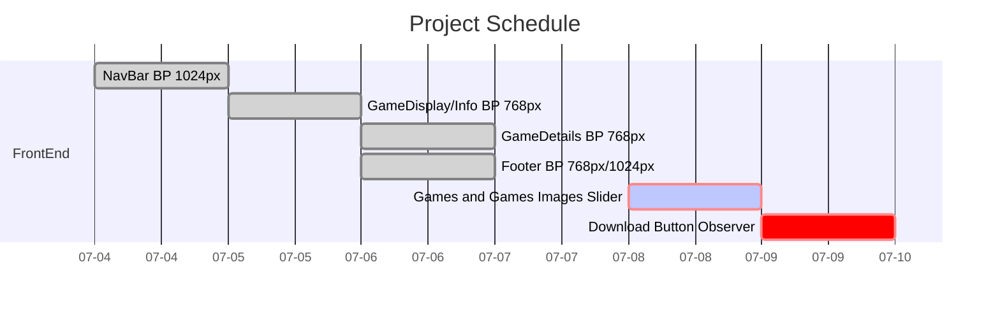

# Creating a nintendo website clone (game purchase site)

### Week July 3rd - July 7th
- [x] NavBar responsive breakpoint at 1024px
- [x] GameDisplay and GameInfo responsive breakpoint at 768px
- [x] GameDetails responsive breakponit at 768px 
- [x] Footer breakpoint at 768px and 1024px
- [ ] Games and GameImages Slider
- [x] Create an intersection observer for the download button to render another component

